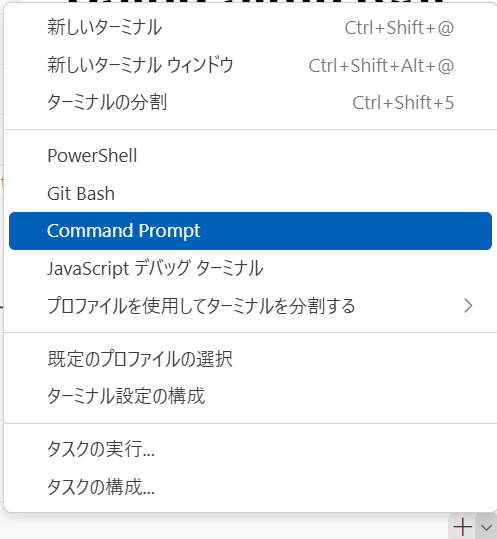

# Using simuTest

## 0. Minicompiler の実行結果をファイルに保存

* 実行とデバッグ(三角形と虫のマーク)から，"MC output **.s" を選んで実行
* input field に 保存するファイル名を指定して Enter を押す．
* 指定したファイルは，simuTest フォルダの中に保存される

## 1. ターミナルを「コマンドプロンプト」で起動する

* ＋マークの右の下向き矢印をクリックし，"“Command Prompt” を選ぶことで，コマンドプロンプトでターミナルを起動できる．
* 通常のターミナルでは，Powershell が起動し，アセンブル結果のリダイレクション時に，UTF BOMコード(UTF16LE)が付いてしまい面倒なので，確実に「command prompt」のターミナルを起動すること．



## 2. sep3asm.jar の実行

* 右下のターミナル選択で "cmd" が選択されていることを確認したうえで以下のようにしてアセンブルを実行する．cd については，起動初回のみ必要．

```bash
\miniCV??> cd simuTest
\miniCV??\simuTest> asm.bat check??-??.a
```

実行すると，指定したファイルの拡張子をbinにしたファイルが生成され，.binの中身がターミナルに出力される．
繰り返しになるが，このコマンドは，「command prompt」が起動しているターミナルで実行のこと．
もし「powershell」で実行してしまった場合は，**.bin ファイルを一旦VS Codeで開いたあと右下の「UTF16LE」となっている部分をクリックし，「エンコード付きで保存する」を選んだあと，「UTF-8」を選んで保存すればOK**であるが，最初から command prompt を使ったほうが楽である．

## 3. sep3simurator.jar の実行

* 右下のターミナル選択で "cmd" が選択されていることを確認したうえで，以下のようにしてシミュレータを起動する．
* 実行できない場合は，simuTest がカレントディレクトリになっていることを確認のこと．

```bash
\miniCV??\simuTest> simu.bat
```


